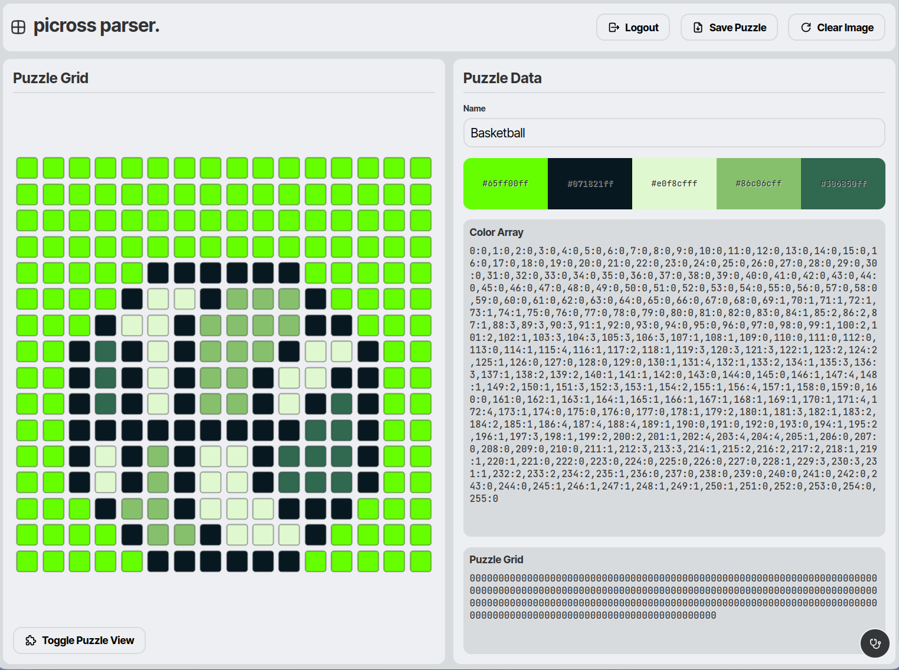

# picross-parser
   

- [Live Build](https://jaohara.github.io/picross-parser/)

This is a repo for the picross-parser portion of my [Picross Capstone Project](https://github.com/users/jaohara/projects/7/).

The idea is to use this React App to extract image data from a pixel image for use with my Picross client project. Data extracted from these images will be exported as JSON, and in the future will be saved in a database for consumption by the Picross game client.

Deploying this Vite project to Github Pages was done with the help of [this guide.](https://github.com/sitek94/vite-deploy-demo)

## Screenshots

Main UI 

Login Dialog UI
